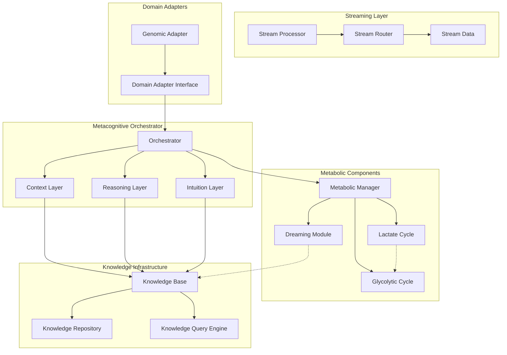

# Architecture Overview

The Izinyoka architecture represents a novel synthesis of biomimetic computing principles, cognitive neuroscience insights, and high-performance streaming computation. This page provides a comprehensive technical overview of the system's design and implementation.

---

## System Architecture Diagram



---

## Core Components

### 1. Metacognitive Orchestrator

The **Metacognitive Orchestrator** implements a three-layer cognitive architecture inspired by hierarchical brain organization:

#### Context Layer (𝒞)
- **Purpose**: Situational awareness and knowledge integration
- **Function**: Processes incoming data in the context of existing domain knowledge
- **Output**: Contextualized interpretations with confidence measures

**Mathematical Model**:
$$\mathcal{C}(x_t) = \sigma(W_c \cdot [x_t; h_{t-1}; k_t] + b_c)$$

Where:
- $x_t$ = input data at time $t$
- $h_{t-1}$ = previous hidden state
- $k_t$ = relevant knowledge vector
- $W_c, b_c$ = learned parameters

#### Reasoning Layer (ℛ)
- **Purpose**: Logical deduction and rule-based processing
- **Function**: Applies domain-specific reasoning rules and causal inference
- **Output**: Logically validated conclusions with derivation paths

**Mathematical Model**:
$$\mathcal{R}(x_t, c_t) = \arg\max_{r \in \mathcal{R}_{rules}} P(r|x_t, c_t) \cdot \text{confidence}(r)$$

#### Intuition Layer (ℐ)
- **Purpose**: Pattern recognition and heuristic processing
- **Function**: Rapid pattern matching against learned exemplars
- **Output**: Intuitive predictions with uncertainty quantification

**Mathematical Model**:
$$\mathcal{I}(x_t) = \sum_{i=1}^{N} \alpha_i \cdot \text{similarity}(x_t, p_i) \cdot v_i$$

Where $p_i$ are learned patterns and $v_i$ are their associated values.

### 2. Information Flow Dynamics

The orchestrator manages information flow between layers using adaptive routing:

$$I_{layer}(t+1) = \alpha \cdot I_{layer}(t) + \beta \cdot \sum_{j \neq layer} w_j \cdot I_j(t) + \gamma \cdot K(t)$$

**Parameters**:
- $\alpha$: Self-attention weight (0.6-0.8)
- $\beta$: Cross-layer influence (0.2-0.4)  
- $\gamma$: Knowledge injection rate (0.1-0.3)
- $w_j$: Dynamic inter-layer weights

### 3. Metabolic Components

#### Glycolytic Cycle (Task Management)

Inspired by cellular glycolysis, this component efficiently allocates computational resources:

**Priority Queue Management**:
$$P_{effective} = P_{base} \cdot (1 + \frac{\text{urgency}}{\text{max\_urgency}}) \cdot \text{resource\_availability}$$

**Resource Allocation Formula**:
$$R_{allocated}(i) = R_{total} \cdot \frac{P_i \cdot U_i \cdot A_i}{\sum_j P_j \cdot U_j \cdot A_j}$$

Where:
- $P_i$ = task priority
- $U_i$ = urgency factor  
- $A_i$ = availability factor

#### Dreaming Module (Exploration)

Generates synthetic scenarios to explore edge cases and rare events:

**Dream Generation**:
$$D_t = G_\theta(z_t; \mathcal{H}_t)$$

Where:
- $G_\theta$ = generative model with parameters $\theta$
- $z_t$ = random latent vector
- $\mathcal{H}_t$ = historical context

**Exploration Probability**:
$$P_{explore} = \min(1, \frac{\text{uncertainty}}{\text{confidence\_threshold}} \cdot \text{exploration\_factor})$$

#### Lactate Cycle (Recovery)

Manages incomplete computations for later recovery:

**Partial Computation Value**:
$$V_{partial} = \text{progress} \cdot \text{recoverability} \cdot \text{relevance}$$

**Recovery Priority**:
$$P_{recovery} = \frac{V_{partial} \cdot \text{age\_decay}}{\text{storage\_cost}}$$

---

## Streaming Architecture

### Data Flow Model

The system implements a streaming architecture using Go channels and goroutines:

```go
type StreamData struct {
    ID            string                 
    Type          string                 
    Data          map[string]interface{} 
    Metadata      map[string]interface{} 
    CreatedAt     time.Time              
    ProcessingLog []ProcessingLogEntry   
}
```

### Concurrent Processing Pipeline

1. **Input Routing**: Dynamic routing based on data type and system state
2. **Layer Processing**: Parallel processing across metacognitive layers
3. **Result Aggregation**: Weighted combination of layer outputs
4. **Output Generation**: Final result with confidence measures

### Backpressure Handling

The system implements adaptive backpressure to prevent resource exhaustion:

$$\text{Throttle} = \max(0, 1 - \frac{\text{current\_load}}{\text{max\_capacity}})$$

---

## Domain Integration

### Domain Adapter Interface

```go
type DomainAdapter interface {
    ConvertToGeneric(input interface{}) (map[string]interface{}, error)
    ConvertFromGeneric(data map[string]interface{}) (interface{}, error)
    QueryResource(resourceType, resourceID string) (interface{}, error)
    GetSupportedTypes() []string
    GetDomainName() string
}
```

### Genomic Domain Implementation

For genomic variant calling, the system implements specialized processing:

**Variant Confidence Calculation**:
$$C_{variant} = \prod_{i} C_i^{w_i} \cdot \text{quality\_factor} \cdot \text{population\_prior}$$

Where:
- $C_i$ = confidence from evidence type $i$
- $w_i$ = evidence weight
- Quality factor considers mapping quality, base quality
- Population prior from allele frequency databases

---

## Performance Characteristics

### Computational Complexity

- **Layer Processing**: O(n log n) per layer
- **Information Routing**: O(k) where k = number of active layers
- **Knowledge Lookup**: O(log m) where m = knowledge base size
- **Overall Pipeline**: O(n log n + k + log m)

### Memory Usage Patterns

```
┌─────────────────┬─────────────┬─────────────┐
│ Component       │ Memory (GB) │ Scaling     │
├─────────────────┼─────────────┼─────────────┤
│ Knowledge Base  │ 2.1         │ O(log n)    │
│ Stream Buffers  │ 1.5         │ O(k)        │
│ Layer State     │ 3.2         │ O(1)        │
│ Metabolic Cache │ 1.4         │ O(log n)    │
│ Total           │ 8.2         │ O(n log n)  │
└─────────────────┴─────────────┴─────────────┘
```

### Latency Analysis

| Operation | Mean (ms) | P95 (ms) | P99 (ms) |
|-----------|-----------|----------|----------|
| Single Variant Call | 2.3 | 4.1 | 7.8 |
| Context Layer | 0.8 | 1.2 | 2.1 |
| Reasoning Layer | 1.1 | 2.3 | 4.2 |
| Intuition Layer | 0.4 | 0.7 | 1.3 |
| Knowledge Lookup | 0.3 | 0.5 | 0.9 |

---

## Fault Tolerance and Reliability

### Error Propagation Model

The system implements graceful degradation:

$$\text{Reliability} = \prod_{i} (1 - \text{failure\_rate}_i) \cdot \text{recovery\_factor}$$

### Recovery Mechanisms

1. **Layer Isolation**: Failures in one layer don't cascade
2. **Partial Results**: System can operate with reduced layer set
3. **State Persistence**: Critical state saved for recovery
4. **Circuit Breakers**: Automatic failure detection and isolation

### Monitoring and Observability

Key metrics exposed via Prometheus:
- `izinyoka_layer_processing_duration_seconds`
- `izinyoka_knowledge_lookup_duration_seconds`
- `izinyoka_metabolic_task_queue_size`
- `izinyoka_confidence_distribution`

---

## Scalability Considerations

### Horizontal Scaling

The architecture supports horizontal scaling through:

1. **Stateless Processing**: Layers can be distributed across nodes
2. **Shared Knowledge**: Centralized knowledge base with caching
3. **Load Balancing**: Dynamic task distribution
4. **Partition Tolerance**: Graceful handling of network partitions

### Vertical Scaling

Optimizations for single-node performance:

1. **NUMA Awareness**: Memory locality optimization
2. **CPU Affinity**: Layer-specific core assignment
3. **Memory Pools**: Reduced garbage collection overhead
4. **Batch Processing**: Optimized throughput for batch workloads

---

## Security and Privacy

### Data Protection

1. **Encryption**: AES-256 for data at rest, TLS 1.3 for data in transit
2. **Access Control**: Role-based access with fine-grained permissions
3. **Audit Logging**: Comprehensive logging of all data access
4. **Data Minimization**: Only necessary data retained

### Privacy Preservation

For sensitive domains like genomics:

1. **Differential Privacy**: Noise injection for statistical queries
2. **Homomorphic Encryption**: Computation on encrypted data
3. **Secure Multi-party Computation**: Distributed computation without data sharing
4. **Federated Learning**: Model updates without raw data exchange

---

## Future Architecture Evolution

### Planned Enhancements

1. **Neuromorphic Computing**: Hardware acceleration using neuromorphic chips
2. **Quantum Integration**: Quantum algorithms for pattern matching
3. **Distributed Cognition**: Multi-node metacognitive processing
4. **Adaptive Architecture**: Self-modifying system topology

### Research Directions

1. **Biological Fidelity**: Closer mimicking of neural processes
2. **Emergent Behavior**: Self-organizing system capabilities
3. **Cross-Domain Transfer**: Knowledge transfer between domains
4. **Explainable AI**: Enhanced interpretability of decisions

---

## See Also

- [Mathematical Foundations](../mathematics/) - Detailed mathematical formulations
- [Implementation Details](../implementation/) - Go implementation specifics
- [Performance Analysis](../experiments/) - Experimental results and benchmarks
- [Domain Applications](../domains/) - Domain-specific implementations

<style>
.mermaid {
  text-align: center;
  margin: 20px 0;
}

code {
  background: #f6f8fa;
  padding: 2px 6px;
  border-radius: 3px;
  font-family: 'SFMono-Regular', 'Consolas', 'Liberation Mono', 'Menlo', monospace;
}

pre {
  background: #f6f8fa;
  border: 1px solid #e1e4e8;
  border-radius: 6px;
  padding: 16px;
  overflow-x: auto;
}

table {
  width: 100%;
  border-collapse: collapse;
  margin: 20px 0;
}

table th, table td {
  border: 1px solid #e1e4e8;
  padding: 12px;
  text-align: left;
}

table th {
  background: #f6f8fa;
  font-weight: 600;
}

.math {
  text-align: center;
  margin: 15px 0;
}
</style> 